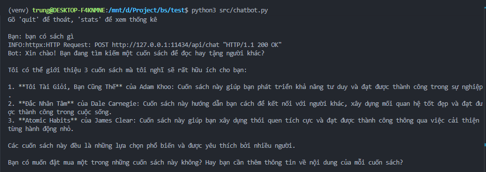
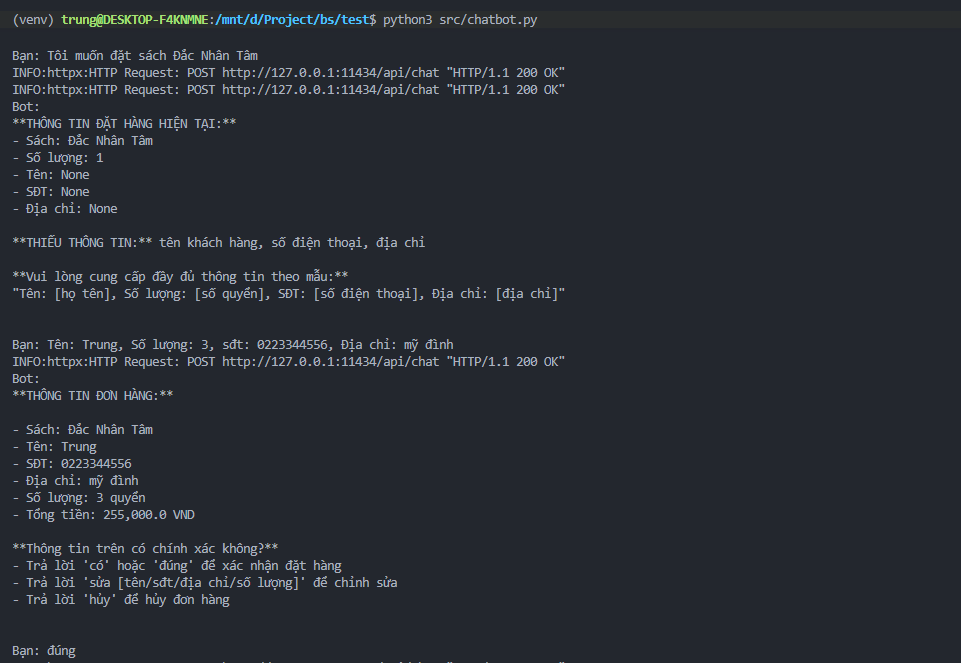
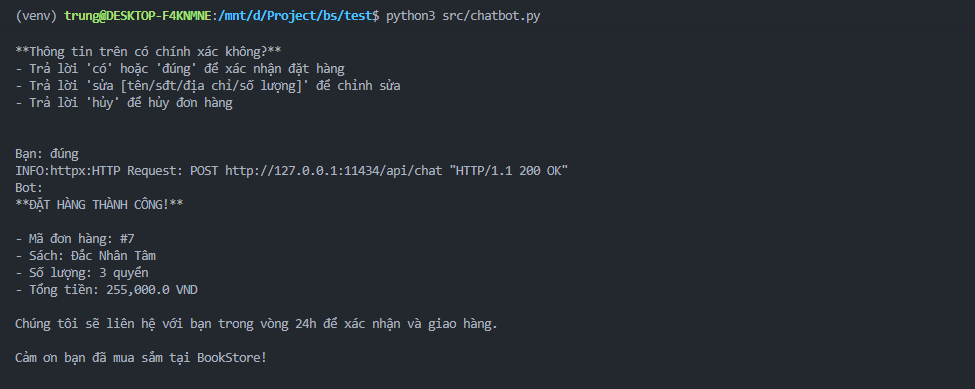
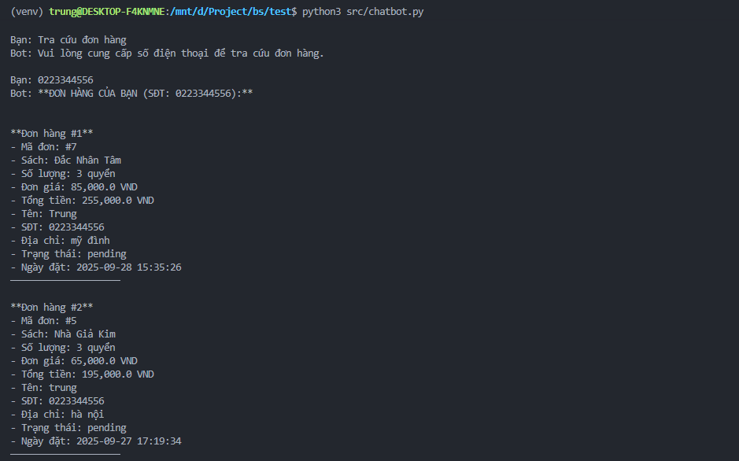

# Chatbot Quản Lý Đơn Hàng BookStore

## Mô tả
Chatbot thông minh hỗ trợ quản lý đơn hàng cho cửa hàng sách trực tuyến với các tính năng:
- Tìm kiếm sách
- Đặt hàng
- Tra cứu đơn hàng

## Cài đặt

### Yêu cầu hệ thống
- Python 3.9+
- pip (Python package manager)

### Cài đặt dependencies
```bash
pip install -r requirements.txt
```

### Cấu trúc thư mục
```
├── chatbot.py          # File chính để chạy chatbot
├── database.py         # Quản lý cơ sở dữ liệu
├── embedding.py        # Xử lý embedding và tìm kiếm
├── llm.py             # Tích hợp Large Language Model
├── rag.py             # RAG
├── config.py          # Cấu hình hệ thống
├── requirements.txt    # Danh sách dependencies
└── data/              # Thư mục chứa dữ liệu
```

## Cách sử dụng

### 1. Khởi chạy chatbot
Mở terminal/command prompt tại thư mục dự án và chạy:

```bash
python3  src/chatbot.py
```

### 2. Tương tác với chatbot

#### Tìm kiếm sách
- **Lệnh**: "Bạn có sách gì"
- **Kết quả**: Hiển thị các sách 

**Tìm kiếm sách**



#### Đặt hàng 
- **Lệnh**: "Tôi muốn đặt sách [tên sách]"
- **Kết quả**: Chatbot yêu cầu cung cấp thông tin để đặt hàng

**Đặt hàng**



#### Xác nhận đơn hàng 
- **Lệnh**: "đúng"
- **Kết quả**: Chatbot xác nhận đơn hàng và đơn hàng thành công

**Xác nhận đơn hàng**



#### Tra cứu đơn hàng
- **Lệnh**: "Tra cứu đơn hàng" 
- **Kết quả**: Chatbot yêu cầu nhập số điện thoại rồi hiển thị các đơn hàng đã đặt

**Tra cứu đơn hàng**



## Các lệnh và từ khóa

### Lệnh chính
- `"Tìm kiếm sách"` - Tra cứu đơn hàng theo SĐT
- `"Đặt sách [tên sách]"` - Kết thúc tra cứu, chuyển sang đặt hàng
- `"Tra cứu đơn hàng"` - Xem gợi ý sách